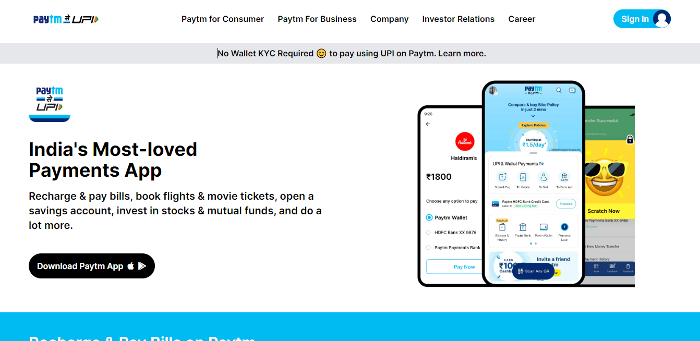

## ⭐Responsive Paytm Clone Using Tailwind CSS⭐

## This website is for educational purpose only

 

## 📌 Live Site URL: <a href="https://nopaytmclonetailwind.netlify.app">**Visit Now**</a>

 

## 📌 Screenshot:

 

## 📌 What I Learned:

- ### Creating responsive website using Tailwind
- ### Setting up tailwind using postCSS
- ### Explored Tailwind documnetation
- ### Use square bracket notation
- ### Flexbox properties in Tailwind

 

## 📌 Time Taken To Complete This Project:

- ### It took me 10 hours to make this Paytm clone

 

## 📌 Social Links:

